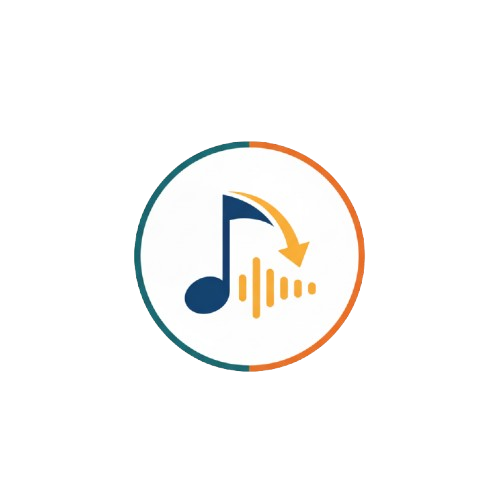

<div align="center">
  
  
  <h1 style="background: linear-gradient(135deg, #a855f7, #3b82f6); -webkit-background-clip: text; -webkit-text-fill-color: transparent; background-clip: text; font-size: 3rem; font-weight: bold; margin: 1rem 0;">
    Tuneport
  </h1>
  
  <p style="font-size: 1.25rem; color: #6b7280; margin-bottom: 2rem;">
    Transform your Spotify library into <strong>downloadable MP3s</strong>
  </p>
</div>

---

Tuneport transforms your Spotify library into downloadable MP3s via YouTube. It's a personal music tool built with Next.js 15, tRPC, and NextAuth for Spotify authentication. The app queues downloads (BullMQ + Redis) and uses yt-dlp to fetch audio from YouTube.uneport

Tuneport transforms your Spotify library into downloadable MP3s via YouTube. It’s a small personal app built with Next.js 15, tRPC, and NextAuth for Spotify authentication. The app queues downloads (BullMQ + Redis) and uses yt-dlp to fetch audio from YouTube.

## Features

- 🎵 **Spotify Integration**: Connect your Spotify account and access your liked songs and playlists
- ⚡ **Lightning Fast Downloads**: Queue and download multiple tracks simultaneously
- 🎨 **Modern UI**: Beautiful dark theme with animated backgrounds and smooth interactions
- 🔒 **Secure & Private**: Your data stays secure with NextAuth authentication
- 📱 **Responsive Design**: Works perfectly on desktop and mobile devices
- 🎯 **High Quality Audio**: Downloads in 320K MP3 format for the best quality

## Tech Stack

- Next.js 15 (App + Pages hybrid)
- NextAuth (Spotify OAuth)
- tRPC for type-safe API
- BullMQ + Redis for background downloads
- yt-dlp for downloading and extracting audio
- TypeScript, Tailwind CSS

## Quickstart

1. Copy `.env.example` to `.env` and fill in the required variables:

- AUTH_SECRET (use `npx auth secret`)
- SPOTIFY_CLIENT_ID
- SPOTIFY_CLIENT_SECRET
- REDIS_HOST, REDIS_PORT, REDIS_PASSWORD (if needed)

2. Install dependencies:

```powershell
npm install
```

3. Start the dev server:

```powershell
npm run dev
```

4. Start a Redis server and ensure `yt-dlp` is available on your PATH for downloads.

## Useful Scripts

- `npm run dev` - start dev server
- `npm run build` - build for production
- `npm run start` - start production server
- `npm run check` - lint + typecheck
- `npm run format:write` - format code

## Notes

- The app uses server-side session handling and download jobs stored in Redis. For production, secure your Redis instance and set up a proper worker process for download jobs.
- Ensure `yt-dlp` and `ffmpeg` are installed and accessible to the worker for reliable audio extraction.
